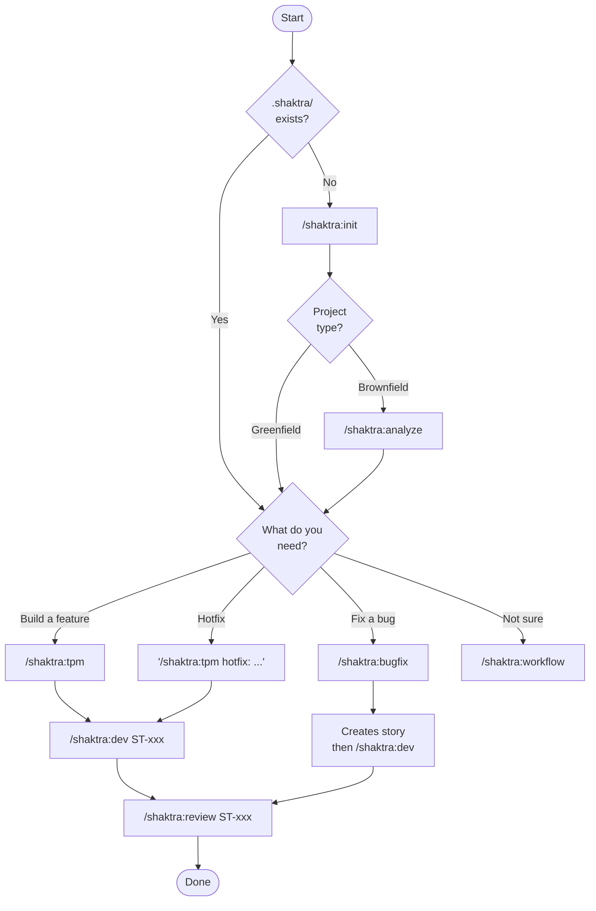

# 1. Quick Start Decision Tree

Shaktra offers different entry paths depending on your project type and immediate need. This decision tree shows which commands to run first based on whether you have an existing codebase or are starting fresh, and whether you need to fix a bug or build a feature.

**Source:** `dist/shaktra/README.md` (Quick Start section)
