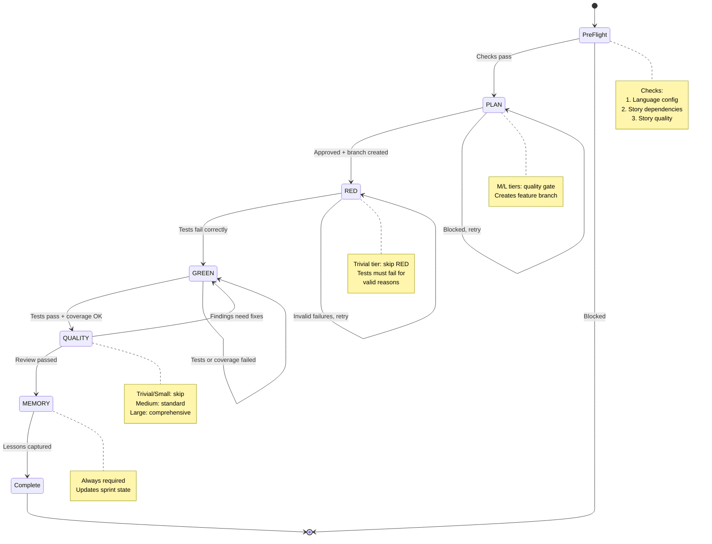

# 2. TDD State Machine

Every story implementation follows a strict 6-phase state machine with quality gates at each transition. The pipeline enforces test-driven development: tests are written before code, and no phase can be skipped. Tier determines which gates activate -- Trivial stories skip RED and QUALITY, while Large stories get expanded review.

### Tier-Aware Gate Matrix

| Phase | Trivial | Small | Medium | Large |
|-------|---------|-------|--------|-------|
| PLAN | Minimal | Minimal | Full + review | Full + review |
| RED | Skip | Required | Required | Required |
| GREEN | Required | Required | Required | Required |
| QUALITY | Skip | Skip | Comprehensive | Comprehensive + expanded |
| MEMORY | Required | Required | Required | Required |

**Source:** `dist/shaktra/skills/shaktra-dev/tdd-pipeline.md`
