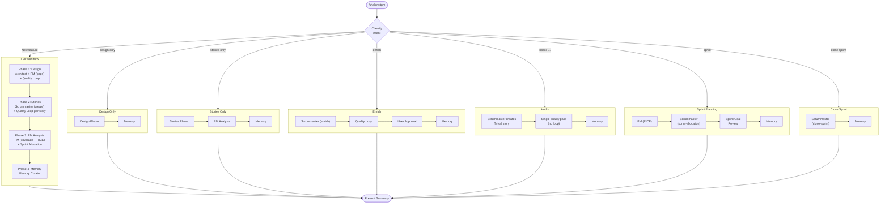

# 3. TPM Workflow Timeline

The Technical Project Manager orchestrates 7 distinct intents, each dispatching a different sequence of specialized agents. The Full workflow is the default path for new features -- it progresses through design, story creation, PM analysis, and memory capture, with quality loops at each stage.

### Agent Sequence by Intent

| Intent | Agents (in order) |
|--------|-------------------|
| Full | Architect, PM (gaps), TPM-Quality, Scrummaster, PM (coverage), PM (RICE), Scrummaster (sprint), Memory Curator |
| Design Only | Architect, PM (gaps), TPM-Quality, Memory Curator |
| Stories Only | Scrummaster, TPM-Quality, PM (coverage), PM (RICE), Scrummaster (sprint), Memory Curator |
| Enrich | Scrummaster (enrich), TPM-Quality, Memory Curator |
| Hotfix | Scrummaster, TPM-Quality, Memory Curator |
| Sprint | PM (RICE), Scrummaster (sprint), Memory Curator |
| Close Sprint | Scrummaster (close), Memory Curator |

**Source:** `dist/shaktra/skills/shaktra-tpm/workflow-template.md`
