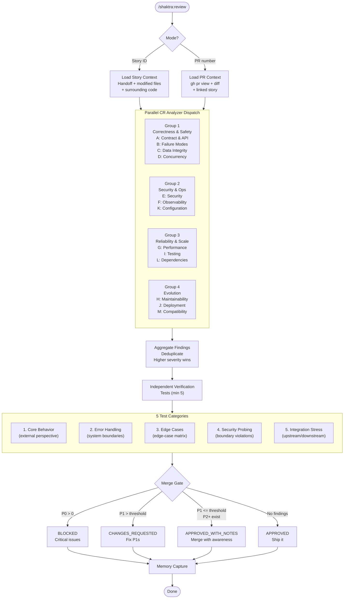

# 4. Code Review Parallel Analysis

The Code Reviewer dispatches CR Analyzer agents across 4 parallel dimension groups, covering all 13 quality dimensions simultaneously. After aggregation, independent verification tests validate behavior from an outsider's perspective. The merge gate applies strict severity rules -- any P0 blocks, P1 count is threshold-gated.

### Reading Guide

- **Top section:** Intent classification routes to story or PR context loading
- **Middle section:** 4 analyzer groups run in parallel, each covering 3-4 dimensions
- **Verification section:** 5 mandatory test categories validate independently of developer tests
- **Bottom section:** Merge gate applies P0/P1 severity rules, then memory capture

### Dimension Reference

| Group | Dimensions | Focus |
|-------|-----------|-------|
| Correctness & Safety | A, B, C, D | Does it work correctly? |
| Security & Ops | E, F, K | Is it secure and observable? |
| Reliability & Scale | G, I, L | Will it hold up? |
| Evolution | H, J, M | Can it evolve safely? |

**Source:** `dist/shaktra/skills/shaktra-review/SKILL.md`
