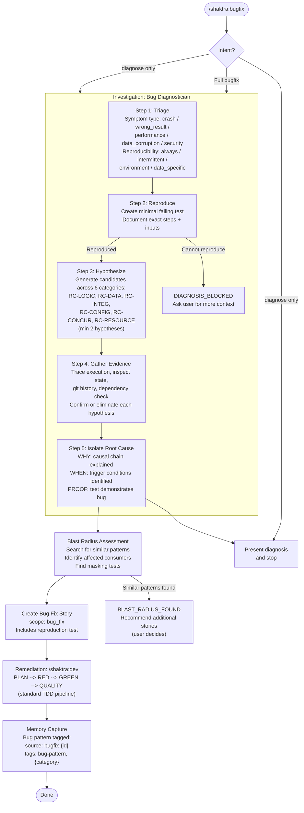

# 5. Bugfix Diagnosis Flow

The Bug Fix workflow splits into two phases: a 5-step investigation that transforms vague bug reports into confirmed root causes, followed by remediation through the standard TDD pipeline (see diagram 02). The diagnosis classifies bugs by symptom type and root cause category, then assesses blast radius to find similar patterns elsewhere in the codebase.

### Severity to Story Tier Mapping

| Bug Severity | Story Tier | Coverage Threshold |
|-------------|-----------|-------------------|
| P0 (production down) | Large | 95% |
| P1 (major broken) | Medium | 90% |
| P2 (minor, workaround) | Small | 80% |
| P3 (cosmetic) | Trivial | 70% |

**Source:** `dist/shaktra/skills/shaktra-bugfix/SKILL.md`, `diagnosis-methodology.md`
