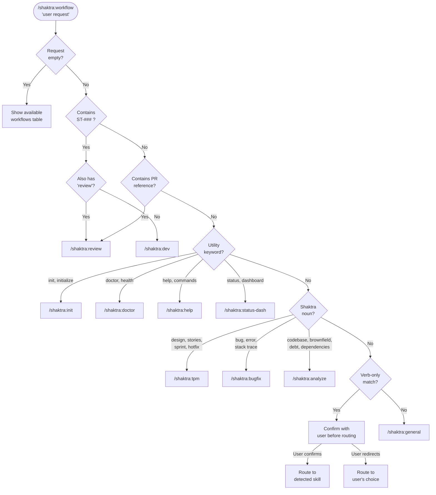

# 6. Workflow Router Decision Tree

The `/shaktra:workflow` router uses a noun-first, two-signal classification model. Shaktra-specific nouns are the primary signal; verbs are secondary. When multiple routes match, a strict priority resolution order determines the target. Ambiguous requests prompt the user for confirmation before dispatching.

### Priority Resolution Order

1. Story ID + "review" --> Review
2. Story ID (without "review") --> Dev
3. PR reference (#number, URL) --> Review
4. Utility keyword match --> Init / Doctor / Help / Status Dash
5. Noun match --> per route table (noun beats verb)
6. Verb-only match --> confirm with user
7. No match --> General

### Key Overlap Resolutions

| Request | Winner | Reason |
|---------|--------|--------|
| "review the design" | TPM | Noun "design" outranks verb "review" |
| "analyze the PR" | Review | Noun "PR" outranks verb "analyze" |
| "fix this bug" | Bug Fix | Noun "bug" routes to bugfix |
| "diagnose this bug" | Bug Fix | Noun "bug" outranks doctor's "diagnose" |

**Source:** `dist/shaktra/skills/shaktra-workflow/SKILL.md`
