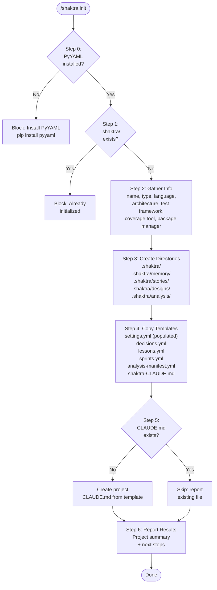

# 7. Init Workflow

Project initialization follows a 6-step sequence that guards against double initialization, gathers project configuration interactively, creates the `.shaktra/` directory structure, and populates it from templates. The workflow produces a fully configured project ready for TPM planning or brownfield analysis.

**Source:** `dist/shaktra/skills/shaktra-init/SKILL.md`
