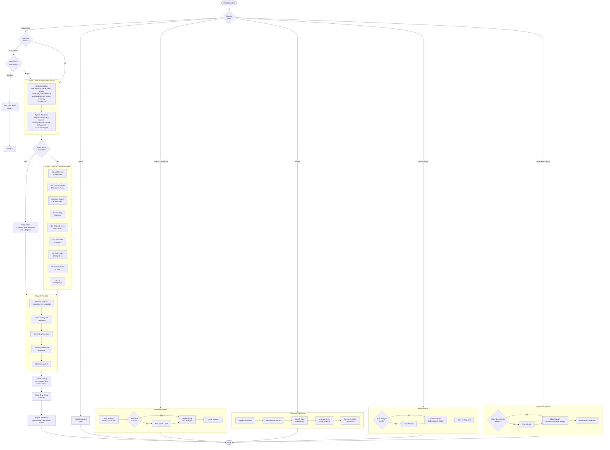

# 8. Analyze Pipeline

The Codebase Analyzer uses a 2-stage pipeline: Stage 1 extracts ground truth via tool-based scanning (no LLM), then Stage 2 dispatches 9 parallel CBA Analyzer agents for deep dimension analysis grounded in that factual data. The pipeline supports 6 intents including incremental refresh and targeted single-dimension analysis.

### Reading Guide

- **Top:** Intent classification routes to one of 6 workflows
- **Left column:** Full analysis flows through Stage 1 (sequential extraction), Stage 2 (parallel deep analysis), Stage 3 (finalization), and Stage 4 (memory)
- **Right column:** Targeted, refresh, debt, and dependency workflows are self-contained sub-flows
- **Stage 2 fork:** Teams availability determines whether analysis uses parallel team members or parallel agents within a single session

### Output Artifacts

| Stage | Artifacts |
|-------|-----------|
| Stage 1 | `static.yml`, `overview.yml` |
| Stage 2 | `structure.yml`, `domain-model.yml`, `entry-points.yml`, `practices.yml`, `dependencies.yml`, `tech-debt.yml`, `data-flows.yml`, `critical-paths.yml`, `git-intelligence.yml` |
| Stage 3 | `checksum.yml`, updated `manifest.yml` |

**Source:** `dist/shaktra/skills/shaktra-analyze/SKILL.md`, `standard-analysis-workflow.md`
