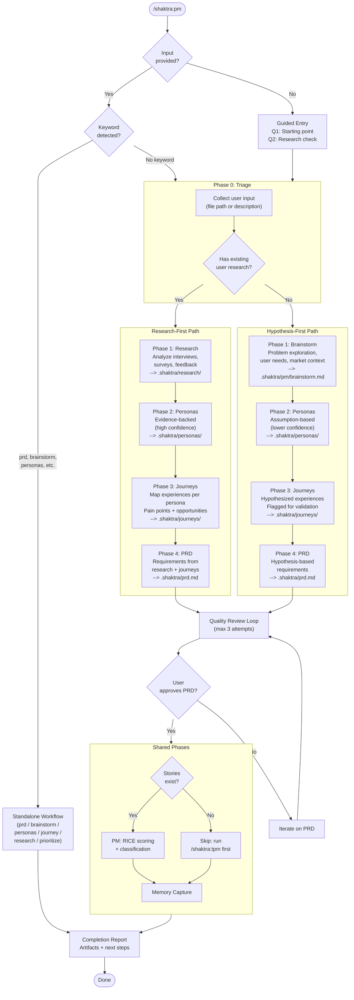

# 9. PM Orchestrated Workflow

The Product Manager skill offers two primary paths based on whether the user has existing research data. Both paths converge on PRD creation as the final artifact, ensuring that personas and journey insights always inform requirements. The research-first path produces evidence-backed artifacts; the hypothesis-first path produces assumption-based artifacts flagged for future validation.

### Path Comparison

| Aspect | Research-First | Hypothesis-First |
|--------|---------------|-----------------|
| Phase 1 | Research analysis | Brainstorm |
| Evidence quality | High (interview data) | Low (assumptions) |
| Persona confidence | High | Medium-Low |
| Journey validity | Grounded in data | Hypothesized |
| PRD traceability | Full (research --> personas --> journeys --> requirements) | Partial (assumptions flagged) |
| Recommended follow-up | Proceed to TPM | Validate with `/shaktra:pm research` |

**Source:** `dist/shaktra/skills/shaktra-pm/SKILL.md`, `full-workflow.md`, `full-workflow-research.md`, `full-workflow-hypothesis.md`
