# 10. Agent Hierarchy

Shaktra's 10 user-invocable skills dispatch work to 12 specialized sub-agents. Each agent runs on a specific model tier -- Opus for deep reasoning and code generation, Sonnet for structured analysis and process execution, Haiku for lightweight knowledge tasks. Skills never execute work directly; they classify intent, dispatch agents, and enforce quality gates.

```mermaid
flowchart TD
    subgraph Skills ["User-Invocable Skills"]
        direction LR
        TPM["/shaktra:tpm"]
        DEV["/shaktra:dev"]
        REV["/shaktra:review"]
        ANA["/shaktra:analyze"]
        PM["/shaktra:pm"]
        BUG["/shaktra:bugfix"]
        GEN["/shaktra:general"]
        INIT["/shaktra:init"]
        DOC["/shaktra:doctor"]
        WF["/shaktra:workflow"]
    end

    subgraph Opus ["Opus Agents"]
        direction TB
        ARCH["Architect\nDesign docs, gap analysis"]
        SWE["SW Engineer\nImplementation plans"]
        TEST["Test Agent\nTDD red-phase tests"]
        DEVR["Developer\nProduction code"]
        DIAG["Bug Diagnostician\n5-step diagnosis"]
        CBA["CBA Analyzer\nCodebase dimensions"]
        CR["CR Analyzer\nQuality dimensions"]
    end

    subgraph Sonnet ["Sonnet Agents"]
        direction TB
        PMR["Product Manager\nGaps, RICE, PRD"]
        SM["Scrummaster\nStories, sprints"]
        TPMQ["TPM Quality\nDesign + story review"]
        SWQ["SW Quality\nCode quality gates"]
    end

    subgraph Haiku ["Haiku Agents"]
        MC["Memory Curator\nLessons learned"]
    end

    TPM --> ARCH
    TPM --> PMR
    TPM --> SM
    TPM --> TPMQ
    TPM --> MC

    DEV --> SWE
    DEV --> TEST
    DEV --> DEVR
    DEV --> SWQ
    DEV --> MC

    REV --> CR
    REV --> MC

    ANA --> CBA
    ANA --> MC

    PM --> PMR
    PM --> MC

    BUG --> DIAG
    BUG --> SWE
    BUG --> TEST
    BUG --> DEVR
    BUG --> SWQ
    BUG --> MC

    GEN --> MC
```

### Reading Guide

- **Top row:** The 10 skills users invoke directly. Left 6 are main agent skills; right 4 are utilities (init, doctor, workflow have no sub-agents shown -- they execute inline).
- **Middle rows:** The 12 sub-agents grouped by model tier. Opus handles tasks requiring deep reasoning (architecture, code generation, analysis). Sonnet handles structured processes (reviews, story creation, prioritization). Haiku handles lightweight extraction (memory curation).
- **Arrows:** Each arrow represents a dispatch relationship -- the skill spawns the agent via Task(). A single skill may dispatch multiple agents sequentially or in parallel depending on the workflow phase.
- **Shared agents:** Memory Curator is dispatched by every main skill at workflow end. SW Quality and Developer are shared between /shaktra:dev and /shaktra:bugfix (bugfix reuses the full TDD pipeline for remediation).

**Source:** `dist/shaktra/skills/shaktra-tpm/SKILL.md`, `dist/shaktra/skills/shaktra-dev/SKILL.md`, `dist/shaktra/skills/shaktra-review/SKILL.md`, `dist/shaktra/skills/shaktra-analyze/SKILL.md`, `dist/shaktra/skills/shaktra-pm/SKILL.md`, `dist/shaktra/skills/shaktra-bugfix/SKILL.md`, `dist/shaktra/agents/*.md`
