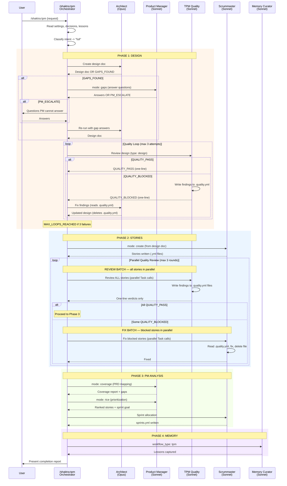

# 11. TPM Agent Dispatch

The TPM orchestrator runs the Full workflow by default -- the most complex agent sequence in Shaktra. It dispatches 5 distinct agents across 4 phases, with quality loops that can retry up to 3 times at each gate. The Architect and Scrummaster are the primary creators; TPM Quality and PM serve supporting roles; Memory Curator closes every workflow.

### Reading Guide

- **Phase 1 (Design)** has the most complex flow: Architect may discover gaps, routing to PM for answers, which may escalate to the user. After the design is created, a quality loop validates it up to 3 times. Findings are written to `.quality.yml` files — the TPM only sees one-line verdicts.
- **Phase 2 (Stories)** reviews ALL stories in parallel per round, then fixes ALL blocked stories in parallel. File-based findings handoff (`.quality.yml`) keeps the TPM's context lean.
- **Phase 3 (PM Analysis)** is linear -- PM scores stories, then Scrummaster allocates to sprints. No quality loops here.
- **Guard tokens** drive control flow: GAPS_FOUND routes to PM, PM_ESCALATE routes to user, QUALITY_BLOCKED triggers a fix cycle, MAX_LOOPS_REACHED halts and escalates.

**Source:** `dist/shaktra/skills/shaktra-tpm/SKILL.md`, `dist/shaktra/skills/shaktra-tpm/workflow-template.md`
