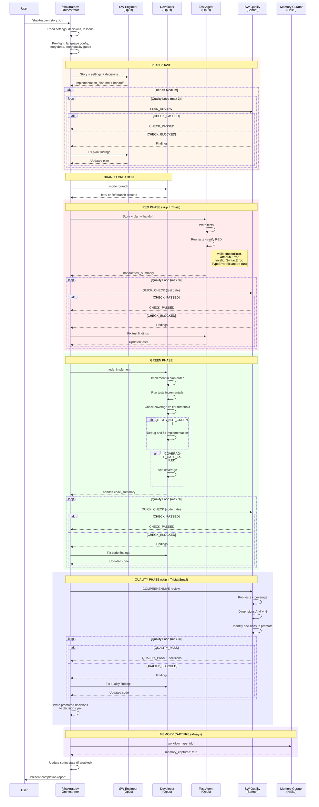

# 12. Dev Agent Dispatch

The Software Development Manager orchestrates the TDD pipeline through 4 phases: PLAN, RED, GREEN, and QUALITY. Each phase has a dedicated creator agent and a quality gate enforced by SW Quality. The pipeline includes branch creation between PLAN and RED, tier-aware gate skipping (Trivial skips RED; Trivial/Small skip QUALITY), and mandatory memory capture at the end.

### Reading Guide

- **Pre-flight checks** block the pipeline if language config, story dependencies, or story quality are insufficient.
- **Quality loops** use a reusable pattern: SW Quality reviews, if blocked the creator agent fixes, up to 3 attempts. After 3 failures, MAX_LOOPS_REACHED escalates to the user.
- **Tier-aware gating:** Trivial stories skip RED and QUALITY. Small stories skip QUALITY. Medium gets standard COMPREHENSIVE. Large gets COMPREHENSIVE + expanded review.
- **Coverage thresholds** are read from settings per tier: hotfix (Trivial), small, standard (Medium), large.
- **Decision promotion** happens during QUALITY phase -- SW Quality identifies patterns worth codifying, and the orchestrator writes them to decisions.yml.

**Source:** `dist/shaktra/skills/shaktra-dev/SKILL.md`, `dist/shaktra/skills/shaktra-dev/tdd-pipeline.md`, `dist/shaktra/agents/shaktra-sw-engineer.md`, `dist/shaktra/agents/shaktra-test-agent.md`, `dist/shaktra/agents/shaktra-developer.md`, `dist/shaktra/agents/shaktra-sw-quality.md`
