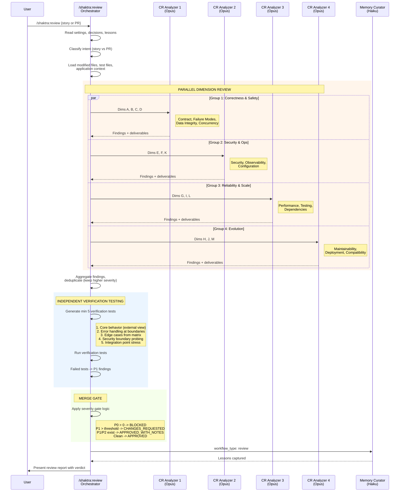

# 13. Review Agent Dispatch

The Code Reviewer orchestrator dispatches 4 CR Analyzer agents in parallel, each covering a group of quality dimensions (A-M). After aggregation, independent verification tests probe for blind spots the developer's tests may share with the code. The merge gate applies severity-based logic to produce one of four verdicts.

### Reading Guide

- **Parallel dispatch** is the key efficiency pattern. Four CR Analyzer agents run simultaneously, each handling 3-4 dimensions. This is the only Shaktra workflow that spawns multiple agents of the same type concurrently.
- **Deduplication** handles cases where two groups flag the same issue (e.g., a missing timeout could appear in both Failure Modes and Performance). The higher severity wins.
- **Verification tests** are fundamentally different from the developer's tests. They test from an external perspective, probe security boundaries, and stress integration points -- catching blind spots where tests and code share the same assumptions.
- **Four verdicts** provide graduated feedback: APPROVED (ship it), APPROVED_WITH_NOTES (merge with awareness), CHANGES_REQUESTED (fix P1s), BLOCKED (critical issues).

**Source:** `dist/shaktra/skills/shaktra-review/SKILL.md`, `dist/shaktra/agents/shaktra-cr-analyzer.md`
