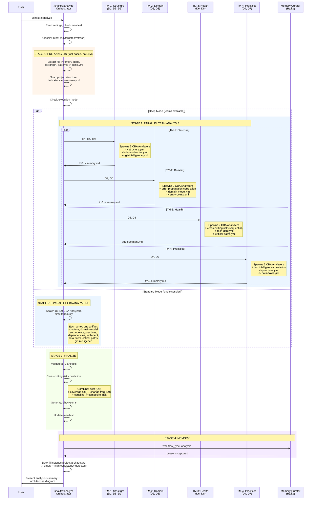

# 14. Analyze Agent Dispatch

The Codebase Analyzer has two execution modes: standard (9 parallel CBA Analyzers in a single session) and deep (4 team members, each spawning 2-3 CBA Analyzer subagents). Both produce the same 9 dimension artifacts. Stage 1 (tool-based pre-analysis) always runs first to establish ground truth before any LLM analysis begins.

### Reading Guide

- **Stage 1** is pure tool execution (Glob, Grep, Bash) with no LLM analysis. It produces static.yml and overview.yml as ground truth that all CBA Analyzers consume.
- **Deep mode** uses 4 team members that each manage 2-3 dimensions. TM-3 has a sequential constraint: its cross-cutting risk agent runs after D6 and D8 complete, optionally reading TM-1's git-intelligence.yml.
- **Standard mode** spawns all 9 CBA Analyzers directly. Simpler but loses the cross-dimension correlation that team members perform.
- **CBA Analyzer** (Opus) is a single agent definition spawned multiple times with different dimension assignments. Each instance writes exactly one YAML artifact.
- **Stage 3** runs in the orchestrator thread: validates artifacts, computes cross-cutting risk if TM-3 did not, generates checksums, and updates the manifest.

**Source:** `dist/shaktra/skills/shaktra-analyze/SKILL.md`, `dist/shaktra/skills/shaktra-analyze/deep-analysis-workflow.md`, `dist/shaktra/skills/shaktra-analyze/standard-analysis-workflow.md`, `dist/shaktra/agents/shaktra-cba-analyzer.md`
