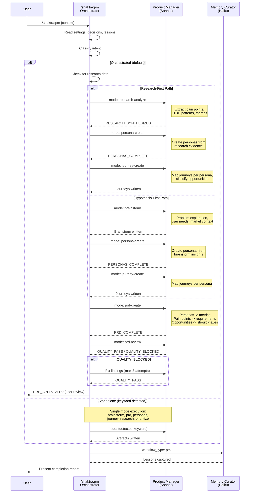

# 15. PM Agent Dispatch

The Product Manager workflow supports two orchestrated flows (research-first and hypothesis-first) plus standalone modes. Both orchestrated flows produce artifacts in a fixed order, with PRD created last so persona and journey insights inform requirements. The PM agent (Sonnet) is spawned repeatedly in different modes rather than using separate agents.

### Reading Guide

- The PM agent is a single agent (Sonnet) invoked in different modes. Each mode produces a distinct artifact type.
- **Orchestrated flow** runs 4-5 sequential PM spawns. The order ensures downstream artifacts build on upstream context (research informs personas, personas inform journeys, all inform the PRD).
- **PRD review** uses the PM agent itself in prd-review mode -- there is no separate quality agent for PM artifacts.
- **Standalone mode** bypasses orchestration for users who need a single artifact (e.g., `/shaktra:pm brainstorm`).
- Memory Curator runs at the end of every PM workflow, regardless of path taken.

**Source:** `dist/shaktra/skills/shaktra-pm/SKILL.md`, `dist/shaktra/skills/shaktra-pm/agent-prompts.md`, `dist/shaktra/agents/shaktra-product-manager.md`
