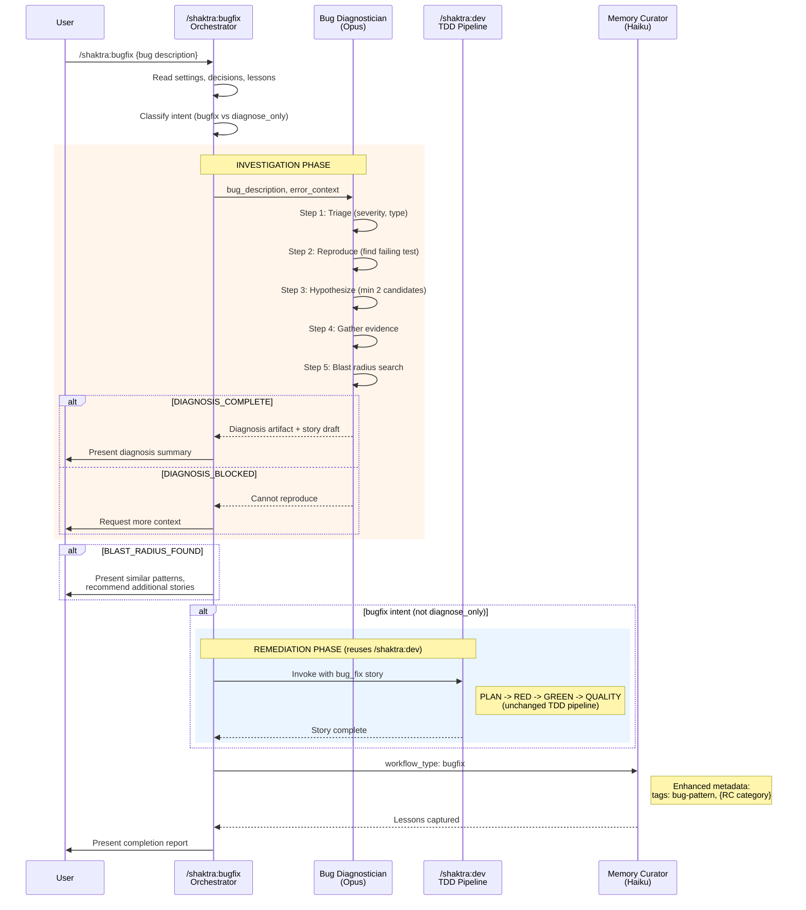

# 16. Bugfix Agent Dispatch

The bugfix workflow has two phases: investigation (unique to bugfix) and remediation (reuses the full TDD pipeline from /shaktra:dev). The Bug Diagnostician never modifies code -- it produces a diagnosis artifact and story draft, then hands off to the standard dev pipeline for the fix.

**Source:** `dist/shaktra/skills/shaktra-bugfix/SKILL.md`, `dist/shaktra/agents/shaktra-bug-diagnostician.md`
