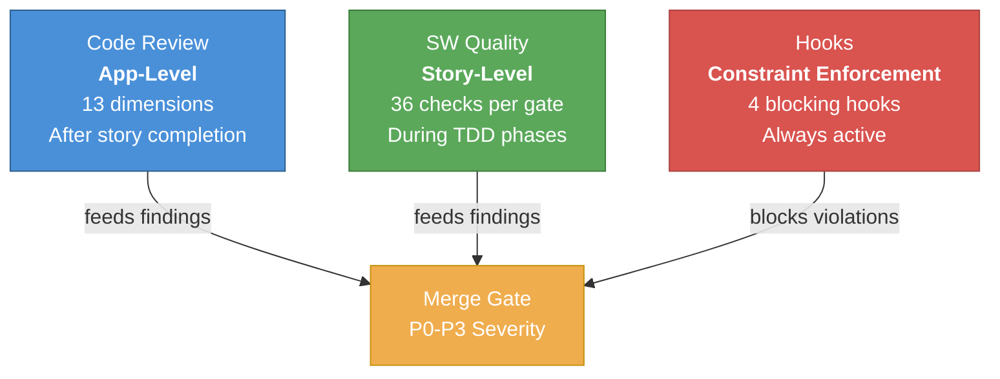

# 17. Quality Tier Pyramid

SW Quality and Code Review operate at different scopes. SW Quality checks story-level correctness during TDD (36 checks per gate), while Code Review checks app-level production readiness after completion (13 dimensions). Both feed findings into the same P0-P3 severity taxonomy and merge gate.

**Reading guide:**
- **Top tier (Code Review):** Broadest scope — reviews how code fits the overall application. Runs once after story completion or on PR.
- **Middle tier (SW Quality):** Story-scoped checks at each TDD phase transition. Runs multiple times per story (plan, test, code, quality gates).
- **Bottom tier (Hooks):** Always-on constraint enforcement. Blocks violations in real time, independent of review workflows.
- All three tiers feed into the shared **Merge Gate** which applies the P0-P3 severity taxonomy.

**Source:** `dist/shaktra/README.md` (Quality & Enforcement section), `dist/shaktra/skills/shaktra-quality/quick-check.md`, `dist/shaktra/skills/shaktra-review/SKILL.md`
