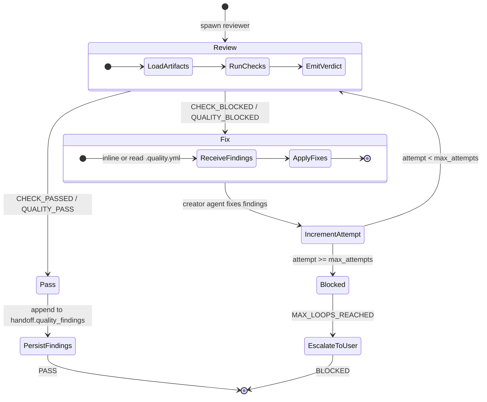

# 18. Quality Loop State Machine

The quality loop is Shaktra's reusable retry pattern for quality gates. When a reviewer finds issues, the creator agent fixes them and the reviewer re-checks. After 3 failed attempts, the loop escalates to the user. This pattern is used at every TDD gate and during TPM design/story review.

**TPM variant:** For story reviews, the TPM uses a **parallel batch** version — all stories reviewed in parallel per round, then all fixes in parallel. Findings are written to `.quality.yml` files (file-based handoff) rather than returned to the orchestrator, keeping TPM context lean.

**Reading guide:**
- The loop starts by spawning a reviewer (sw-quality or tpm-quality) on the artifact.
- On **PASS**, findings are persisted to the handoff and the gate succeeds.
- On **BLOCKED**, the creator agent receives findings (inline for TDD, or reads from `.quality.yml` for TPM) and applies fixes, then the reviewer runs again.
- After **3 failed attempts** (configurable via `max_attempts`), the loop emits `MAX_LOOPS_REACHED` and escalates to the user with all unresolved findings.
- Prior findings from the same gate are marked `resolved: true` if they no longer appear on re-review.

**Source:** `dist/shaktra/skills/shaktra-tpm/workflow-template.md` (Quality Loop Pattern), `dist/shaktra/skills/shaktra-dev/tdd-pipeline.md` (Quality Loop Pattern)
