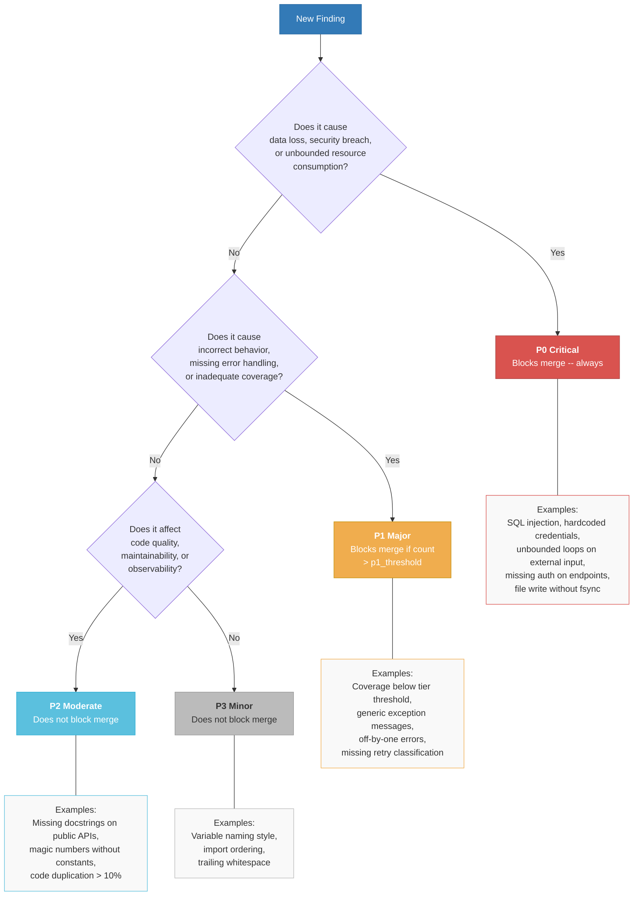

# 19. Severity Taxonomy Decision Tree

Every quality finding in Shaktra is classified into one of four severity levels (P0-P3). This decision tree shows how to classify a finding based on its impact. The severity taxonomy is defined in exactly one file and referenced everywhere else.

**Reading guide:**
- Start at the top with any new finding.
- Each decision node asks about the **impact** of the finding, moving from most severe to least.
- P0 findings always block merge. P1 findings block merge only when they exceed `settings.quality.p1_threshold`. P2 and P3 never block merge.
- Example boxes show representative findings for each severity level drawn from the canonical taxonomy.

**Source:** `dist/shaktra/skills/shaktra-reference/severity-taxonomy.md` (canonical source for P0-P3 definitions)
