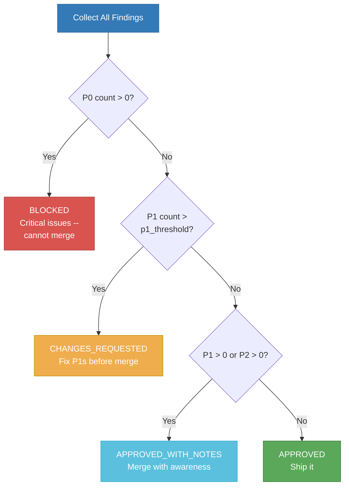

# 20. Merge Gate Logic

The merge gate evaluates all findings from quality reviews and produces one of four verdicts. P0 findings always block. P1 findings block when they exceed the configurable threshold. The same logic is used by both SW Quality (during TDD) and Code Review (after completion).

**Source:** `dist/shaktra/skills/shaktra-reference/severity-taxonomy.md` (Merge Gate Logic), `dist/shaktra/skills/shaktra-review/SKILL.md` (Verdicts section)
