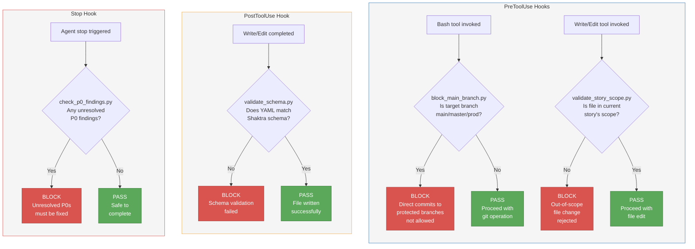

# 21. Hook Execution Flow

Shaktra enforces four blocking hooks at different points in the development lifecycle. Hooks are all-or-nothing: they block or they do not exist. There is no warn-only mode. Each hook is a Python script triggered by Claude Code's hook system.

**Reading guide:**
- **PreToolUse** hooks run before a tool executes. `block_main_branch` intercepts git operations targeting protected branches. `validate_story_scope` intercepts file edits outside the current story's file list.
- **PostToolUse** hook runs after a Write/Edit completes. `validate_schema` checks that any `.shaktra/` YAML file conforms to its schema.
- **Stop** hook runs when the agent finishes. `check_p0_findings` prevents completion if unresolved P0 findings remain in any story handoff.
- Every hook is implemented as a Python script for cross-platform compatibility (no shell-specific commands like `grep -oP`).

**Source:** `dist/shaktra/hooks/hooks.json`, `dist/shaktra/README.md` (Hooks: Enforcement Rules section)
