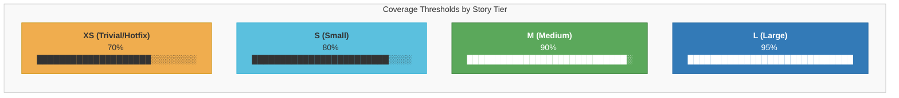

# 22. Coverage Threshold by Tier

Each story tier has a minimum test coverage threshold enforced at the GREEN phase quality gate. Larger stories require higher coverage because they carry more risk. All thresholds are configurable in `.shaktra/settings.yml`.

**Reading guide:**
- **XS (70%):** Hotfixes and trivial changes. Lowest bar -- speed matters more than exhaustive coverage.
- **S (80%):** Small stories with limited scope. Standard coverage for focused changes.
- **M (90%):** Medium stories -- the default tier. Most features land here.
- **L (95%):** Large stories with architectural impact. Near-complete coverage required due to higher blast radius.
- Thresholds are read from `settings.tdd` at runtime; the values above are defaults set by `/shaktra:init`.

**Source:** `dist/shaktra/README.md` (Coverage thresholds by tier), `dist/shaktra/skills/shaktra-dev/tdd-pipeline.md` (Tier-Aware Gate Matrix)
