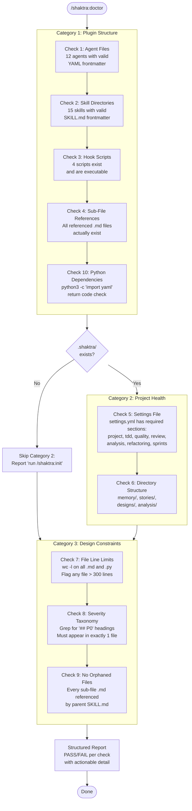

# 23. Doctor Health Check

The `/shaktra:doctor` skill runs 10 read-only checks across 3 categories: plugin structure (5 checks validating agents, skills, hooks, sub-file references, and Python dependencies), project health (2 checks on settings and directory structure), and design constraints (3 checks enforcing file limits, severity taxonomy uniqueness, and orphan detection). Each category degrades gracefully — a missing `.shaktra/` directory skips Category 2 without failing the whole report.

### Reading Guide

- **Category 1** runs against the installed plugin at `${CLAUDE_PLUGIN_ROOT}` — validates the plugin is structurally complete
- **Category 2** runs against the project's `.shaktra/` directory — skipped entirely if the project is not initialized
- **Category 3** runs against `${CLAUDE_PLUGIN_ROOT}` — enforces Shaktra design rules (300-line limit, single severity definition, no orphans)
- Each check produces PASS or FAIL independently; failures include actionable remediation steps

**Source:** `dist/shaktra/skills/shaktra-doctor/SKILL.md`
