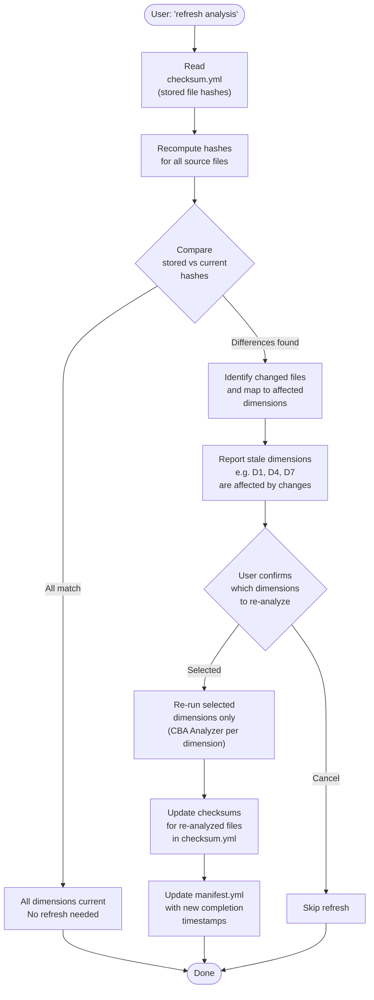

# 24. Analyze Incremental Refresh

When the user requests an analysis refresh, the analyzer compares stored file checksums against current state to detect which source files have changed. Changed files are mapped to their affected dimensions (D1-D9), and only the stale dimensions are re-analyzed after user confirmation. This avoids re-running the full 2-stage pipeline for minor code changes.

### Reading Guide

- **Top:** Reads stored checksums from the previous full or incremental analysis run
- **Center:** File-level hash comparison identifies which source files changed, then maps those files to the analysis dimensions they affect
- **Bottom:** Only user-confirmed stale dimensions are re-run, keeping the refresh targeted and efficient
- The file-to-dimension mapping uses the same static extraction logic from Stage 1 to determine which dimensions depend on which files

**Source:** `dist/shaktra/skills/shaktra-analyze/SKILL.md` (Incremental Refresh section)
