# 25. Debt Strategy Workflow

Debt strategy transforms raw technical debt findings from D6 analysis into a prioritized remediation plan. The CBA Analyzer reads `tech-debt.yml`, categorizes each item into one of 4 categories (Safety, Velocity, Reliability, Maintenance), scores them on impact and effort, assigns remediation tiers, and generates story drafts for urgent and strategic items.

```mermaid
flowchart LR
    Start([Debt Strategy\nrequest]) --> CheckD6{"tech-debt.yml\nexists?"}

    CheckD6 -->|No| RunD6["Run D6 dimension\nfirst"]
    RunD6 --> ReadDebt
    CheckD6 -->|Yes| ReadDebt["Read\ntech-debt.yml"]

    ReadDebt --> Categorize

    subgraph Categorize ["Categorize Debt Items"]
        direction TB
        Safety["Safety\nCVEs, credentials,\nmissing validation"]
        Velocity["Velocity\nGod modules, circular deps,\nhigh coupling"]
        Reliability["Reliability\nTest gaps, flaky tests,\nmissing error handling"]
        Maintenance["Maintenance\nDead code, deprecated APIs,\nmixed conventions"]
    end

    Categorize --> Score["Score Each Item\nimpact (1-5)\nx effort_to_fix (1-5)\n= priority_score"]

    Score --> Tiers

    subgraph Tiers ["Assign Remediation Tiers"]
        direction TB
        Urgent["Urgent\nSafety impact >= 4\nOR score >= 20\n--> Next sprint"]
        Strategic["Strategic\nVelocity/Reliability score >= 12\nOR any score 15-19\n--> Next 2-3 sprints"]
        Opportunistic["Opportunistic\nscore < 12\nOR Maintenance\n--> Fix when nearby"]
    end

    Tiers --> Generate{"Tier?"}
    Generate -->|Urgent / Strategic| Stories["Generate Story Drafts\nTitle, scope,\n3-5 acceptance criteria"]
    Generate -->|Opportunistic| DocTrigger["Document\ntrigger files only"]

    Stories --> Metrics["Calculate Metrics\ntotal_items, health_score_current,\nprojected_score_after_urgent"]
    DocTrigger --> Metrics

    Metrics --> Output["Write\ndebt-strategy.yml"]
    Output --> Done([Done])
```

### Reading Guide

- **Left:** Prerequisite check ensures D6 data exists before proceeding
- **Center:** Each debt item flows through categorization (4 types) then scoring (impact x effort)
- **Right:** Tier assignment determines whether items get dedicated stories (Urgent/Strategic) or are deferred (Opportunistic)
- **Output:** `debt-strategy.yml` feeds into `/shaktra:tpm` for sprint planning

**Source:** `dist/shaktra/skills/shaktra-analyze/debt-strategy.md`
