# 26. Dependency Audit Workflow

Dependency audit transforms D5 analysis findings into a risk-ranked upgrade plan. The CBA Analyzer reads `dependencies.yml`, categorizes each dependency risk into one of 4 types (Critical, Outdated, Overlap, License), assesses upgrade difficulty, generates appropriately scoped stories, and produces a prioritized upgrade sequence.

```mermaid
flowchart LR
    Start([Dependency Audit\nrequest]) --> CheckD5{"dependencies.yml\nexists?"}

    CheckD5 -->|No| RunD5["Run D5 dimension\nfirst"]
    RunD5 --> ReadDeps
    CheckD5 -->|Yes| ReadDeps["Read\ndependencies.yml"]

    ReadDeps --> RiskCat

    subgraph RiskCat ["Risk Categorization"]
        direction TB
        Critical["Critical\nKnown CVEs, abandoned libs,\ndeprecated with no migration"]
        Outdated["Outdated\nMajor version behind stable,\nbreaking changes pending"]
        Overlap["Overlap\nMultiple libs for same purpose,\nfunctionality duplication"]
        License["License\nIncompatible or restrictive,\nGPL in proprietary project"]
    end

    RiskCat --> Assess

    subgraph Assess ["Upgrade Difficulty"]
        direction TB
        Easy["Easy\nDrop-in, no breaking changes\n< 1 hour"]
        Moderate["Moderate\nMinor API changes\n1-3 days with testing"]
        Hard["Hard\nMajor breaking changes\n> 3 days, data migration"]
    end

    Assess --> StoryGen

    subgraph StoryGen ["Story Generation"]
        direction TB
        CritStory["Critical: 1 story each\n[Security] Remediate pkg"]
        OutStory["Outdated: Grouped stories\n[Upgrade] Update group"]
        OverStory["Overlap: Consolidation\n[Consolidate] Standardize on winner"]
        LicStory["License: Risk assessment\nRecommend alternative or review"]
    end

    StoryGen --> Priority["Prioritized Upgrade Plan\n1. Critical (CVEs)\n2. Outdated hard (schedule early)\n3. Outdated easy + Overlap"]

    Priority --> Metrics["Calculate Metrics\ntotal_dependencies,\nhealthy_percent,\ncritical_count, outdated_count"]

    Metrics --> Output["Write\ndependency-audit.yml"]
    Output --> Done([Done])
```

### Reading Guide

- **Left:** Prerequisite check ensures D5 data exists before proceeding
- **Center:** Each dependency flows through risk categorization (4 types) then difficulty assessment (easy/moderate/hard)
- **Right:** Story generation adapts to risk type — Critical items get individual stories, Outdated items are grouped by ecosystem, Overlap items get consolidation stories
- **Output:** `dependency-audit.yml` feeds into `/shaktra:tpm` for sprint planning

**Source:** `dist/shaktra/skills/shaktra-analyze/dependency-audit.md`
