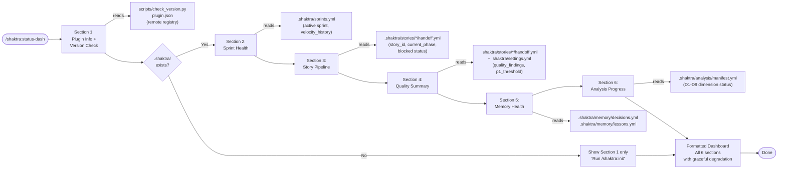

# 27. Status Dashboard Data Flow

The status dashboard reads from 6 independent data sources to assemble a read-only project overview. Each section degrades gracefully — missing files produce a short message rather than failing the dashboard. If `.shaktra/` does not exist, only the plugin info section renders.

### Reading Guide

- **Left to right:** Each section executes in order, reading its specific data sources
- **Section 1** always runs — it reads from the plugin directory, not from `.shaktra/`
- **Sections 2-6** require `.shaktra/` — if missing, the dashboard short-circuits after Section 1
- Each section handles its own missing-file scenario independently (graceful degradation)

**Source:** `dist/shaktra/skills/shaktra-status-dash/SKILL.md`
