# 28. Plugin Directory Structure

Shaktra is distributed as a Claude Code plugin. All plugin code lives in `dist/shaktra/` — this is the only directory that gets installed. Dev-only files (docs, Resources, CLAUDE.md) remain at the repo root and never ship to users. The marketplace catalog at `.claude-plugin/marketplace.json` uses `"source": "./dist/shaktra"` to scope what gets installed.

```mermaid
graph TD
    ROOT["shaktra-plugin/"] --> MP[".claude-plugin/<br/>marketplace.json"]
    ROOT --> DIST["dist/shaktra/<br/>THE PLUGIN"]
    ROOT --> DOCS["docs/<br/>dev-only"]
    ROOT --> RES["Resources/<br/>dev-only"]
    ROOT --> CM["CLAUDE.md<br/>dev-only"]

    DIST --> PLUG[".claude-plugin/<br/>plugin.json"]
    DIST --> AGENTS["agents/<br/>12 sub-agents"]
    DIST --> SKILLS["skills/<br/>16 skill dirs"]
    DIST --> HOOKS["hooks/<br/>hooks.json"]
    DIST --> SCRIPTS["scripts/<br/>Python hook scripts"]
    DIST --> TEMPLATES["templates/<br/>state file templates"]
    DIST --> DIAG["diagrams/<br/>architecture diagrams"]
    DIST --> README["README.md<br/>user-facing docs"]

    AGENTS --> A1["shaktra-architect.md"]
    AGENTS --> A2["shaktra-developer.md"]
    AGENTS --> A3["shaktra-sw-quality.md"]
    AGENTS --> A4["... 9 more agents"]

    SKILLS --> S1["shaktra-tpm/"]
    SKILLS --> S2["shaktra-dev/"]
    SKILLS --> S3["shaktra-review/"]
    SKILLS --> S4["shaktra-reference/"]
    SKILLS --> S5["... 12 more skills"]

    HOOKS --> H1["block-main-branch"]
    HOOKS --> H2["check-p0"]
    HOOKS --> H3["validate-story-scope"]
    HOOKS --> H4["validate-schema"]

    style DIST fill:#337ab7,stroke:#2a6496,color:#fff
    style DOCS fill:#f5f5f5,stroke:#999,color:#999
    style RES fill:#f5f5f5,stroke:#999,color:#999
    style CM fill:#f5f5f5,stroke:#999,color:#999
    style PLUG fill:#5ba85b,stroke:#3a7a3a,color:#fff
```

**Reading guide:**
- The **blue node** is the plugin root — everything inside ships to users on install.
- **Greyed-out nodes** are dev-only files that never leave the repository.
- The **green node** (`plugin.json`) is required by the Claude Code plugin spec — it declares name, version, description, and repository.
- `marketplace.json` at the repo root enables multi-plugin marketplace distribution. Its `"source": "./dist/shaktra"` field scopes what gets installed.

**Source:** `CLAUDE.md` (Plugin Structure section), `dist/shaktra/.claude-plugin/plugin.json`
