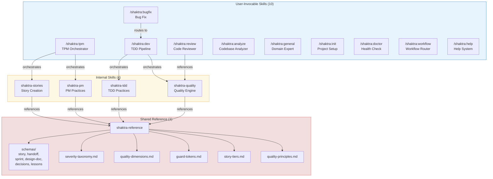

# 29. Skill Layering Architecture

Shaktra organizes its 16 skills into three distinct layers: user-invocable skills (the entry points users interact with), internal skills (loaded by agents, never called directly), and the shared reference layer (schemas, taxonomies, and practices used by all components). The key design rule is **no content duplication** — skills define behavior, agents reference it, and the reference layer provides shared definitions.

**Reading guide:**
- **Top layer (blue):** User-invocable skills — these appear as `/shaktra:name` commands. They orchestrate workflows by spawning agents.
- **Middle layer (yellow):** Internal skills — loaded by agents via their `skills:` frontmatter field. Never called by users directly. They define HOW work is done (quality checks, TDD practices, story creation rules).
- **Bottom layer (red):** Shared reference — the single source of truth for schemas, severity definitions, guard tokens, and quality dimensions. Every internal skill and most agents reference this layer. Content is defined here exactly once.
- Arrows show the dependency direction: user skills orchestrate internal skills, internal skills reference the shared layer.

**Source:** `dist/shaktra/skills/*/SKILL.md` (frontmatter), `CLAUDE.md` (Component Overview)
