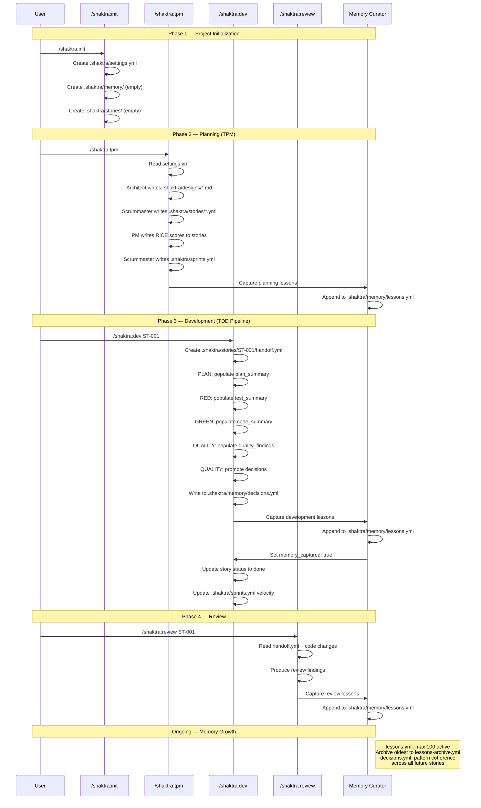

# 30. State File Lifecycle

Shaktra maintains project state across several YAML files in `.shaktra/`. Each file has a distinct lifecycle — created at a specific point, updated by specific workflows, and consumed by downstream agents. This diagram traces how state files evolve from project initialization through planning, development, and memory capture.

**Reading guide:**
- **Phase 1** creates the skeleton — `settings.yml` is the project-wide configuration that every workflow reads.
- **Phase 2** populates planning artifacts — designs, stories, sprints. The TPM workflow ends with memory capture.
- **Phase 3** is the TDD pipeline where `handoff.yml` accumulates state through each phase (plan, tests, code, quality). Decisions are promoted to `decisions.yml` for cross-story consistency. Sprint velocity updates after each story completes.
- **Phase 4** adds review-level insights to lessons.
- Memory files grow across all workflows. `lessons.yml` caps at 100 entries with archival. `decisions.yml` accumulates architectural patterns that influence all future stories.

**Source:** `dist/shaktra/skills/shaktra-reference/schemas/handoff-schema.md`, `dist/shaktra/skills/shaktra-tpm/workflow-template.md`, `dist/shaktra/skills/shaktra-dev/tdd-pipeline.md`
