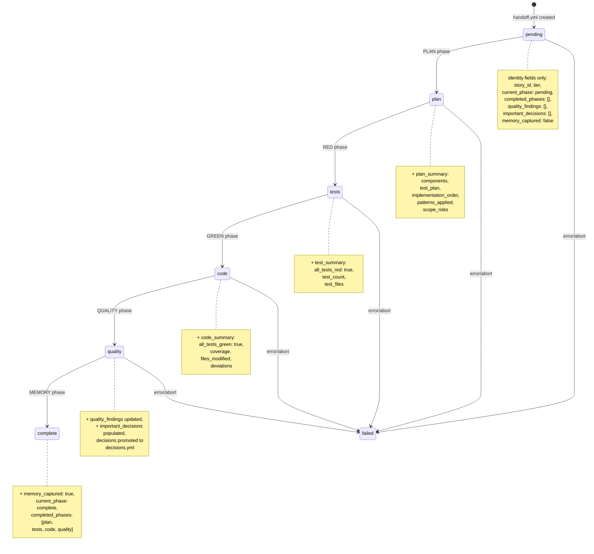

# 31. Handoff Schema Evolution

The `handoff.yml` file is a state machine that tracks a story through the TDD pipeline. Fields are populated incrementally — each phase adds its section while preserving all prior state. This diagram shows how the handoff schema evolves as a story progresses from pending through completion.

**Source:** `dist/shaktra/skills/shaktra-reference/schemas/handoff-schema.md`, `dist/shaktra/skills/shaktra-dev/tdd-pipeline.md`
