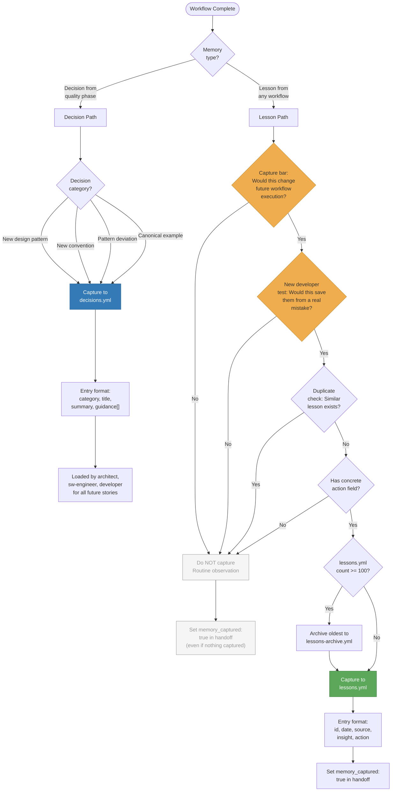

# 32. Memory Capture Decision Tree

Shaktra maintains two memory files: `decisions.yml` for architectural patterns and conventions, and `lessons.yml` for workflow insights. The capture bar is deliberately high — "Would this materially change future workflow execution?" Routine operations are noise and must be filtered out. This diagram shows how the memory curator decides what to capture and where.

**Reading guide:**
- **Decision path (blue):** Decisions are promoted during the QUALITY phase of TDD. They capture design patterns, architectural conventions, and canonical examples. These persist in `decisions.yml` and are loaded by architect, sw-engineer, and developer agents for all future stories.
- **Lesson path (green):** Lessons pass through a multi-step filter (yellow nodes). The capture bar is intentionally strict — "tests passed" or "coverage met" are NOT lessons.
- **Grey nodes** represent filtered-out observations. Even when nothing is captured, `memory_captured` is set to true to satisfy the handoff completion guard.
- `lessons.yml` caps at 100 active entries. Oldest entries are archived before new ones are appended.

**Source:** `dist/shaktra/agents/shaktra-memory-curator.md`, `dist/shaktra/skills/shaktra-reference/schemas/handoff-schema.md`
