# 33. Guard Token Flow

Shaktra uses guard tokens as plain-text signals emitted by agents to control workflow progression. There are 14 core tokens defined in `guard-tokens.md`, plus 15 domain-specific tokens defined in individual skill files. Tokens fall into four categories: phase progression, quality gates, workflow control, and communication. This diagram maps every token to its emitter and the workflow response.

```mermaid
graph LR
    subgraph PhaseTokens["Phase Progression"]
        TNR["TESTS_NOT_RED"]
        TNG["TESTS_NOT_GREEN"]
        PGF["PHASE_GATE_FAILED"]
        CGF["COVERAGE_GATE_FAILED"]
    end

    subgraph QualityTokens["Quality Gates"]
        CP["CHECK_PASSED"]
        CB["CHECK_BLOCKED"]
        QP["QUALITY_PASS"]
        QB["QUALITY_BLOCKED"]
        RP["REFACTOR_PASS"]
        RB["REFACTOR_BLOCKED"]
    end

    subgraph WorkflowTokens["Workflow Control"]
        MLR["MAX_LOOPS_REACHED"]
    end

    subgraph CommTokens["Communication"]
        GF["GAPS_FOUND"]
        CN["CLARIFICATION_NEEDED"]
        VF["VALIDATION_FAILED"]
    end

    subgraph BugfixTokens["Bugfix Domain"]
        DC["DIAGNOSIS_COMPLETE"]
        DB["DIAGNOSIS_BLOCKED"]
        BRF["BLAST_RADIUS_FOUND"]
    end

    subgraph ReviewTokens["Review Domain"]
        RA["REVIEW_APPROVED"]
        RAN["REVIEW_APPROVED<br/>_WITH_NOTES"]
        RCR["REVIEW_CHANGES<br/>_REQUESTED"]
        RBLK["REVIEW_BLOCKED"]
    end

    subgraph AnalyzeTokens["Analyze Domain"]
        AC["ANALYSIS_COMPLETE"]
        AP["ANALYSIS_PARTIAL"]
        AS["ANALYSIS_STALE"]
    end

    subgraph GeneralTokens["General Domain"]
        DD["DOMAIN_DETECTED"]
        DN["DOMAIN_NONE"]
        ER["ESCALATION<br/>_RECOMMENDED"]
    end

    subgraph Emitters["Emitters"]
        direction TB
        TA["Test Agent"]
        DEVR["Developer"]
        SWQ["SW Quality"]
        TPMQ["TPM Quality"]
        ORCH["Orchestrator"]
        ARCH["Architect"]
        BUGD["Bug Diagnostician"]
        CRA["CR Analyzer"]
        CBA["CBA Analyzer"]
        GENE["General Skill"]
    end

    subgraph Responses["Workflow Response"]
        direction TB
        BLOCK_IMPL["Block implementation"]
        RETRY_IMPL["Return to developer"]
        FIX_LOOP["Enter fix loop"]
        PROCEED["Proceed to next phase"]
        ESC_USER["Escalate to user"]
        FILL_GAPS["Return to planning"]
        ROUTE_TDD["Route to TDD pipeline"]
        MERGE_OK["Allow merge"]
        REQ_CHANGES["Request changes"]
        STOP["Stop workflow"]
    end

    TA --> TNR
    DEVR --> TNG
    DEVR --> CGF
    SWQ --> PGF
    SWQ --> CP
    SWQ --> CB
    SWQ --> QP
    SWQ --> QB
    SWQ --> RP
    SWQ --> RB
    SWQ --> CGF
    TPMQ --> QP
    TPMQ --> QB
    ORCH --> MLR
    ARCH --> GF
    BUGD --> DC
    BUGD --> DB
    BUGD --> BRF
    CRA --> RA
    CRA --> RAN
    CRA --> RCR
    CRA --> RBLK
    CBA --> AC
    CBA --> AP
    CBA --> AS
    GENE --> DD
    GENE --> DN
    GENE --> ER

    TNR --> BLOCK_IMPL
    TNG --> RETRY_IMPL
    PGF --> FIX_LOOP
    CGF --> RETRY_IMPL
    CP --> PROCEED
    CB --> FIX_LOOP
    QP --> PROCEED
    QB --> FIX_LOOP
    RP --> PROCEED
    RB --> FIX_LOOP
    MLR --> ESC_USER
    GF --> FILL_GAPS
    CN --> ESC_USER
    VF --> ESC_USER
    DC --> ROUTE_TDD
    DB --> ESC_USER
    BRF --> ESC_USER
    RA --> MERGE_OK
    RAN --> MERGE_OK
    RCR --> REQ_CHANGES
    RBLK --> STOP
    AC --> PROCEED
    AP --> ESC_USER
    AS --> ESC_USER
    DD --> PROCEED
    DN --> PROCEED
    ER --> STOP

    style PhaseTokens fill:#fcf8e3,stroke:#f0ad4e,color:#333
    style QualityTokens fill:#e8f4fd,stroke:#337ab7,color:#333
    style WorkflowTokens fill:#f2dede,stroke:#d9534f,color:#333
    style CommTokens fill:#dff0d8,stroke:#5ba85b,color:#333
    style BugfixTokens fill:#f5e6ff,stroke:#8a6dab,color:#333
    style ReviewTokens fill:#fff3e0,stroke:#e67e22,color:#333
    style AnalyzeTokens fill:#e0f7fa,stroke:#0097a7,color:#333
    style GeneralTokens fill:#fce4ec,stroke:#c62828,color:#333
```

**Reading guide:**
- **Left column (Emitters):** The 10 agents and orchestrators that produce guard tokens during workflow execution.
- **Center columns (Token groups):** 29 total tokens organized by domain. The 14 core tokens (Phase, Quality, Workflow, Communication) are defined in `guard-tokens.md`. The 15 domain tokens are defined in their respective SKILL.md files.
- **Right column (Responses):** The 10 workflow responses triggered by tokens. Responses range from proceeding to the next phase (green path) to blocking the workflow and escalating to the user (red path).
- **Token flow pattern:** Emitter produces token --> token routes to response --> response either continues the workflow or blocks it.
- **Fix loops** are bounded: `MAX_LOOPS_REACHED` fires after 3 failed attempts at any gate, escalating to the user rather than looping forever.
- **Quality tokens** have a dual emitter pattern: `QUALITY_PASS` and `QUALITY_BLOCKED` can come from either SW Quality (TDD pipeline) or TPM Quality (planning pipeline), but the response is identical.

**Source:** `dist/shaktra/skills/shaktra-reference/guard-tokens.md`, `dist/shaktra/skills/shaktra-bugfix/SKILL.md`, `dist/shaktra/skills/shaktra-review/SKILL.md`, `dist/shaktra/skills/shaktra-analyze/SKILL.md`, `dist/shaktra/skills/shaktra-general/SKILL.md`, `dist/shaktra/agents/shaktra-sw-quality.md`
